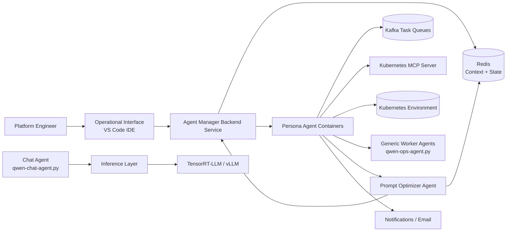

# MASON System Architecture

MASON combines a VS Code operational interface, an agent lifecycle manager, chat and worker agents, shared memory, task queues, and Kubernetes tools.

## Main Flow

1. The user works through the VS Code-based operational interface.
2. The agent manager registers, instantiates, restarts, or removes persona containers.
3. Chat and worker agents use Redis for context, Kafka for task events, and the Kubernetes MCP server for cluster actions.
4. Prompt optimization updates persona prompts through a review-and-approve loop.
5. Worker agents report task summaries and notifications back to the operator.

## Code Anchors

- [management/backend/app.py](../management/backend/app.py) exposes the agent lifecycle API.
- [docker-compose.yml](../docker-compose.yml) wires the agent manager, worker agents, Kafka, Redis, and Kubernetes MCP server.
- [agent/qwen-chat-agent.py](../agent/qwen-chat-agent.py) is the chat agent entrypoint.
- [agent/qwen-ops-agent.py](../agent/qwen-ops-agent.py) is the generic worker agent entrypoint.
- [agent/serving/optimization/tensorrt_llm/scripts/serve.sh](../agent/serving/optimization/tensorrt_llm/scripts/serve.sh) and the compose profiles define the TensorRT-LLM path.
- [agent/client/ux/vscode-task-viewer/README.md](../agent/client/ux/vscode-task-viewer/README.md) documents the VS Code operational UI.

## Notes

- The repository uses TensorRT-LLM and vLLM for model serving; the FastAPI model server exists in code but is not the primary serving path.
- This document stays concise and reflects the control flow implemented in the codebase.